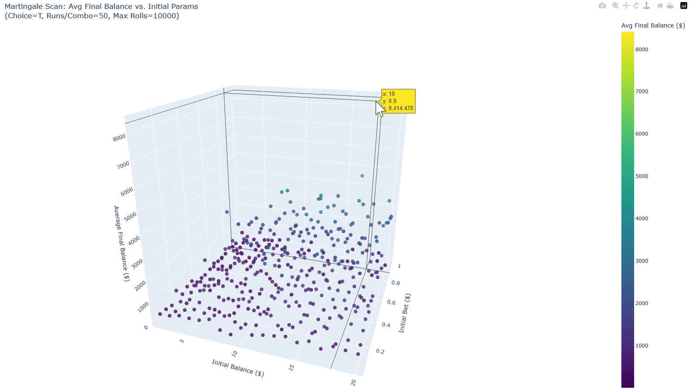

# Martingale Strategy Simulators

Simulate and analyze roulette games using the Martingale Strategy with different tools.

## MartingalePlotter.py

Simulates the Martingale strategy with enhanced features:

*   **Multiple Runs:** Run single or multiple simulations (`--num_runs`).
*   **Statistics:** Calculates aggregate statistics over multiple runs (average rolls, final balance, max balance, bankruptcy rate).
*   **Parameterization:** Configure initial balance, initial bet, betting choice, max rolls via command-line arguments.
*   **Parameter Scan Mode (`--mode scan`):**
    *   Runs simulations across a range of initial balances and bets.
    *   Generates an interactive 3D plot (`martingale_scan_3d.html`) showing average final balance for each parameter combination using Plotly.
*   **Plotting:**
    *   Optionally plots the balance history of the last run using Matplotlib (`--plot_last`).
    *   Generates interactive 3D HTML plots in scan mode.

### Single Run Plot Example

When running a single simulation with plotting enabled (default or using `--plot_last`), a Matplotlib graph shows the balance history:


### Parameter Scan Example

The `--mode scan` generates an interactive 3D plot allowing exploration of how initial parameters affect outcomes.


*(Note: The actual output is an interactive HTML file: `martingale_scan_3d.html`)*

### Usage Examples

```bash
# Run a single default simulation and plot with Matplotlib
python MartingalePlotter.py

# Run 100 simulations and show statistics
python MartingalePlotter.py --num_runs 100

# Run 50 simulations with custom parameters (betting on CT)
python MartingalePlotter.py --num_runs 50 --balance 100 --bet 0.5 --choice CT

# Run parameter scan with default ranges and generate interactive 3D plot
python MartingalePlotter.py --mode scan

# Run parameter scan with custom ranges
python MartingalePlotter.py --mode scan --balance_start 10 --balance_end 50 --bet_start 0.1 --bet_end 0.5 --runs_per_combo 20

# View all options
python MartingalePlotter.py --help
```

## SurvivalSimulator.py

Simulate many runs of "Rolls before bankruptcy" until a specific bet count. 
This will show the odds of survival for the current betting strategy within the given amount of rolls. 


