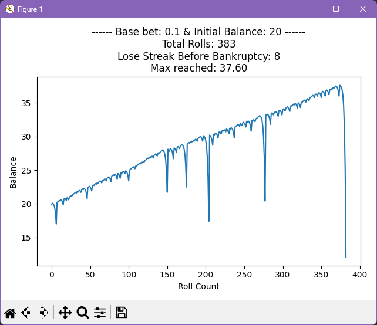
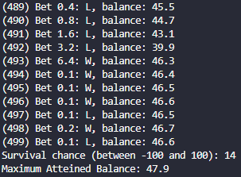

# MartingalePlotter

Simulate and plot roulette games using the Martingale Strategy. 

## MartingalePlotter.py

Plots a graph of a single run of rolls using the Martingale Strategy. 

## SurvivalSimulator.py

Simulate many runs of "Rolls before bankruptcy" until a specific bet count. 
This will show the odds of survival for the current betting strategy within the given amount of rolls. 

